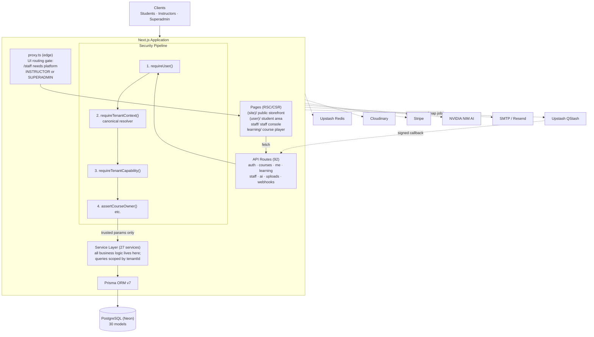
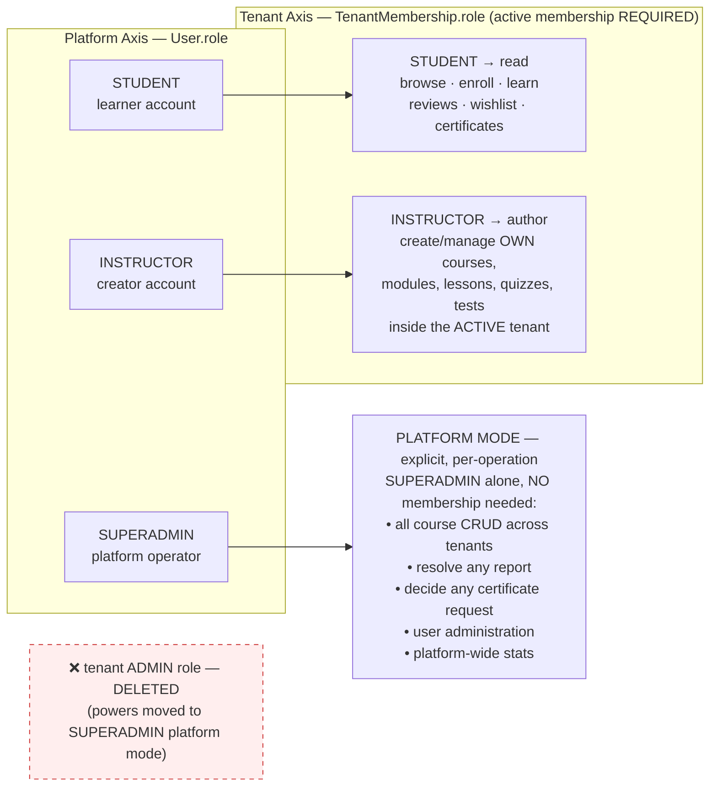
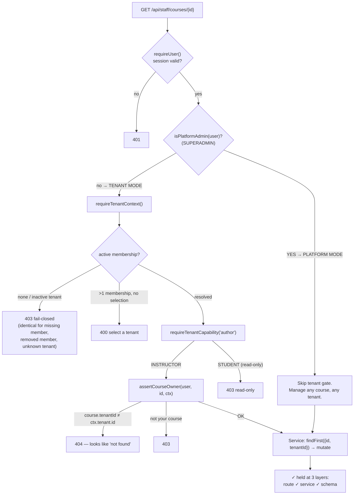
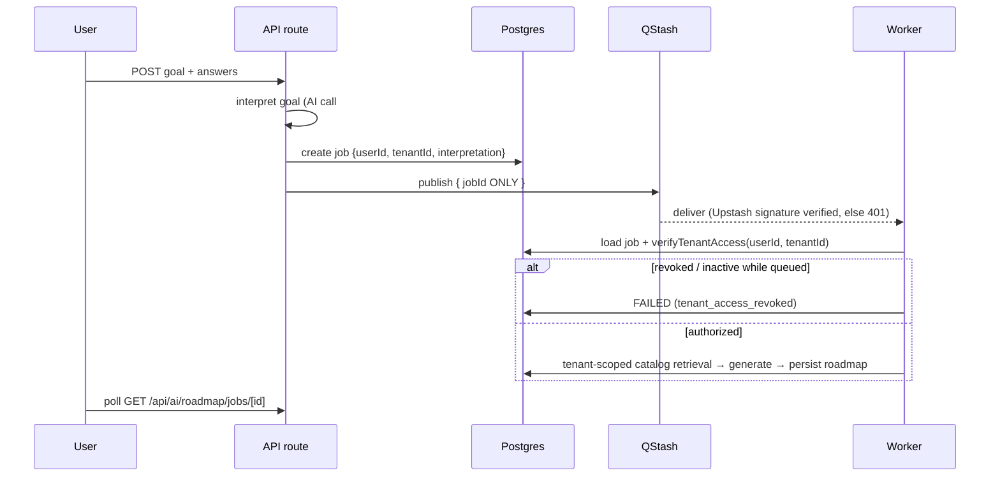

# EduPro — Full Project Architecture

> E-learning platform: Next.js 16 · React 19 · Prisma 7 · PostgreSQL (Neon).
> Multi-tenant, marketplace-style: tenants publish courses, learners enroll and
> earn certificates, AI builds personalized learning roadmaps.
>
> Companion docs: `MULTI_TENANCY_PHASES_E-O.md` (security hardening log),
> `ROADMAP-REDESIGN-PLAN.md`, `MIGRATION_STATUS.md`.

---

## Table of Contents

1. [Tech Stack](#1-tech-stack)
2. [System Overview](#2-system-overview)
3. [Directory Layout](#3-directory-layout)
4. [Role & Authority Model](#4-role--authority-model)
5. [Request Authorization Flow](#5-request-authorization-flow)
6. [Feature Map — What the Product Does](#6-feature-map--what-the-product-does)
7. [API Route Inventory (92 routes)](#7-api-route-inventory-92-routes)
8. [Data Model (30 models)](#8-data-model-30-models)
9. [Service Layer](#9-service-layer)
10. [Background Jobs & Async Flows](#10-background-jobs--async-flows)
11. [External Integrations](#11-external-integrations)
12. [Cross-Cutting Infrastructure](#12-cross-cutting-infrastructure)
13. [Security Architecture Summary](#13-security-architecture-summary)

---

## 1. Tech Stack

| Layer | Technology |
|---|---|
| Framework | Next.js 16 (App Router, RSC), React 19, TypeScript |
| Styling | Tailwind CSS v4, shadcn/ui components, lucide-react icons |
| Data | Prisma ORM 7 + PostgreSQL (Neon), driver adapter `@prisma/adapter-pg` |
| Auth | Custom JWT access/refresh cookies (`jose`), bcrypt passwords, TOTP 2FA (`otplib`-style via `totp.ts`), OTP codes for email verification |
| State/data fetching | TanStack Query v5 |
| Payments | Stripe (checkout + webhooks) |
| Files | Cloudinary (images/video/certificate PDFs) |
| Queues | Upstash QStash (roadmap generation worker) |
| Cache/rate-limit | Upstash Redis (`@upstash/ratelimit`) |
| AI | NVIDIA NIM (model catalog + benchmarking), deterministic fallback interpreter |
| Email | Nodemailer SMTP / Resend |
| PDF | pdfkit (certificate rendering) |
| i18n | Hand-rolled dictionaries (`src/i18n/en.ts`, `th.ts`) — English/Thai |
| Validation | Zod schemas in `src/lib/validation/*` |
| Tooling | ESLint 9 flat config, tsx test runner (`node:test`), Prisma Migrate |

---

## 2. System Overview



---

## 3. Directory Layout

```
├── prisma/
│   ├── schema.prisma          # 30 models, 19 enums
│   ├── seed.ts                # default tenant, categories, courses, superadmin
│   └── migrations/            # baseline + drift + multi-tenancy migrations
├── scripts/                   # operational one-offs
├── tests/
│   ├── *.test.ts              # unit tests (172) — pure logic modules
│   ├── integration/           # 14 suites — real DB, service/guard level
│   └── e2e/                   # live-server smoke + roadmap flows
├── src/
│   ├── app/
│   │   ├── (site)/            # PUBLIC storefront (no login): home, catalog,
│   │   │                      # course detail, about, certificate verify
│   │   ├── (user)/[userId]/   # STUDENT area: dashboard, my-courses, saved,
│   │   │                      # certificates, reports, roadmap, profile
│   │   ├── staff/             # STAFF CONSOLE: dashboard/analytics, courses,
│   │   │                      # enrollments, users, certificate-requests,
│   │   │                      # certificates, reports, notifications, register
│   │   ├── learning/[courseId]# COURSE PLAYER: lessons, quiz/test runners
│   │   └── api/               # 92 routes (full inventory §7)
│   ├── server/
│   │   ├── tenant-context.ts  # CANONICAL tenant resolver
│   │   ├── authorization.ts   # capability model (read/author + platform mode)
│   │   ├── guards.ts          # auth gates + ownership guards
│   │   └── services/          # 27 services — all business logic
│   ├── lib/                   # framework-less utilities:
│   │   ├── auth.ts jwt.ts password.ts otp.ts totp.ts remember-me.ts
│   │   ├── api.ts errors.ts validation/     # request plumbing
│   │   ├── ai/                # provider abstraction, NIM client, retrieval,
│   │   │                      # goal interpretation, prompt building
│   │   ├── stripe.ts cloudinary.ts upload.ts pdf.ts email.ts
│   │   ├── ratelimit.ts metrics.ts logger.ts crypto.ts html.ts
│   │   └── slug.ts urls.ts json.ts utils.ts async.ts
│   ├── components/            # ui/ (shadcn), site chrome, catalog, learning,
│   │                          # admin (staff console), roadmap, user panels
│   ├── i18n/                  # en/th dictionaries
│   ├── generated/prisma/      # generated client (committed path config)
│   ├── proxy.ts               # edge middleware (UI gate only)
│   └── types/                 # shared TS types
```

---

## 4. Role & Authority Model

Two **independent** axes — never merged, never inferred from each other:

- **Platform axis** (`User.role`): who you are on the platform.
- **Tenant axis** (`TenantMembership.role`): what you may do inside ONE tenant.
  Requires an active membership; resolved ONLY by `src/server/tenant-context.ts`.



**Conflict rules** (never infer one axis from the other):

| Platform role | Tenant membership | Result |
|---|---|---|
| INSTRUCTOR | STUDENT in tenant A | READ only in A — authoring denied |
| STUDENT | INSTRUCTOR in tenant A | AUTHOR in A (staff console UI still gated by platform role) |
| SUPERADMIN | no membership | Full PLATFORM MODE control of every tenant |
| SUPERADMIN | any membership | Also acts as that membership inside the tenant |

---

## 5. Request Authorization Flow



Client-supplied tenant identifiers (`?tenantId=`, `x-tenant-slug`) are selection
hints only — validated against the caller's own memberships before anything else.

---

## 6. Feature Map — What the Product Does

### Public storefront `(site)/` — anonymous
- **Home** — marketing page with live platform stats (students, courses, certificates)
- **Course catalog** `/courses` — search, category filter, price filter, sort;
  published courses from all tenants (marketplace model)
- **Course detail** `/courses/[slug]` — curriculum preview, reviews, instructor info,
  enroll/wishlist actions for logged-in users
- **Certificate verification** `/certificates/verify` — public lookup by certificate number
- **About** — instructor directory

### Student area `(user)/[userId]/`
- **Dashboard** — progress overview
- **My courses** — enrolled courses with per-course completion %
- **Learning player** `/learning/[courseId]` — lesson viewer (video/article),
  mark-complete tracking, module quizzes, final test/exam runner
- **Saved** — wishlist
- **Certificates** — earned certificates, PDF download, request flow after passing final test
- **Roadmap** `/roadmap` — AI-generated learning paths (see §10)
- **Reports** — report a course, track resolution
- **Profile** — username/avatar, change password, enable/disable TOTP two-step

### Staff console `staff/`
- **Dashboard** — platform stats (superadmin) or personal analytics (instructor)
- **Courses** — CRUD, rich editor (modules → lessons → quizzes → final tests),
  submit-for-review workflow, approve/reject/publish (superadmin), draft/unpublish
- **Enrollments** — view/remove students per course
- **Users** — list, role management, ban/unban, delete (superadmin); staff invites
- **Certificate requests** — approve → issues certificate; reject → notifies student
- **Reports** — moderation queue
- **Notifications** — in-app notification center
- **Register** — invite-token staff onboarding

### Auth & security features
Register → email OTP verification · login/logout · refresh rotation ·
forgot/reset password · optional TOTP two-step (login then verify-otp) ·
change password · rate limiting on sensitive endpoints

### Commerce
Free courses enroll directly; paid courses go through Stripe checkout
(`/api/courses/[id]/checkout` → Stripe → signed webhook → PAID order → enrollment granted)

### AI Roadmaps
Goal → interpretation (AI + deterministic fallback, clarification loop) →
tenant-scoped catalog retrieval → staged weekly plan with real matched courses →
save/discard/refine → progress-aware item status

---

## 7. API Route Inventory (92 routes)

| Group | Routes | Purpose |
|---|---|---|
| `api/auth/*` (14) | register, login, logout, refresh, me, verify-email, resend-verification, forgot-password, reset-password, verify-otp, enable-2fa(+confirm), disable-2fa, change-password | Account lifecycle & session |
| `api/courses*` (9) | list (public catalog), `[id]/enroll`, `[id]/enrollment-status`, `[id]/wishlist`, `[id]/reviews`, `[id]/checkout` (+confirm), reviews create/update | Discovery & enrollment |
| `api/learning/*` (6) | `[courseId]` content, `[courseId]/complete/[lessonId]`, `quiz` (submit/list results), `test/[testId]` start/status/submit | Course player engine |
| `api/me/*` (9) | profile, scores, certificates, certificate-requests, enrollments, wishlist, notifications (list/read/read-all/[id]) | Student self-service |
| `api/staff/*` (29) | courses CRUD + draft/publish/reject/submit, modules, lessons, quizzes, questions, tests, enrollments (list/delete), users (list/patch/delete/restrict), stats ×7 (platform + instructor analytics), issue-certificate, certificate-requests, reports, register | Staff console backend |
| `api/ai/*` (4) | roadmap start (with clarification loop), jobs/[id] polling, jobs/worker (signed), models catalog | AI pipeline |
| `api/roadmaps*` (2) | list+draft, [id] get/save/discard/refine/delete | Roadmap lifecycle |
| `api/comments*` (3) | lesson comments (list/create), update/delete own, like toggle | Discussion |
| `api/reviews*` (2) | course reviews (enrolled-only), update own | Ratings |
| `api/certificates/*` (2) | public check-by-number, request issuance | Certification |
| `api/categories` (1) | global category list (public) | Taxonomy |
| `api/uploads` (1) | magic-byte validated media upload | Content |
| `api/webhooks/stripe` (1) | payment completion | Commerce |
| `api/reports` (1) | student report creation/listing | Moderation |
| `api/health`, `health/ready`, `metrics` (3) | liveness, readiness (SELECT 1), Prometheus-style counters (opt-in) | Ops |

---

## 8. Data Model (30 models)

Global (no `tenantId` — deliberately): **User, Category, RefreshToken,
PasswordReset, OtpCode, Notification, Order, CommentLike**.
Everything else is tenant-owned (required `tenantId`).

```mermaid
erDiagram
    TENANT ||--o{ TENANT_MEMBERSHIP : has
    USER ||--o{ TENANT_MEMBERSHIP : joins
    USER ||--o{ COURSE : instructs
    CATEGORY ||--o{ COURSE : classifies
    COURSE ||--o{ MODULE : contains
    MODULE ||--o{ LESSON : contains
    MODULE ||--o{ QUIZ : contains
    QUIZ ||--o{ QUIZ_RESULT : "scored by"
    COURSE ||--o{ TEST : "final exam"
    TEST ||--o{ TEST_RESULT : "scored by"
    USER ||--o{ ENROLLMENT : holds
    COURSE ||--o{ ENROLLMENT : "enrolled in"
    ENROLLMENT ||--o{ COMPLETED_LESSON : tracks
    LESSON ||--o{ COMPLETED_LESSON : completed
    USER ||--o{ COMMENT : writes
    LESSON ||--o{ COMMENT : has
    COMMENT ||--o{ COMMENT_LIKE : receives
    COURSE ||--o{ REVIEW : receives
    USER ||--o{ WISHLIST_ITEM : saves
    COURSE ||--o{ REPORT : "reported via"
    USER ||--o{ CERTIFICATE : earns
    CERTIFICATE_REQUEST }o--|| COURSE : targets
    ORDER }o--|| COURSE : purchases
    ROADMAP ||--o{ ROADMAP_ITEM : contains
    ROADMAP_GENERATION }o--|| USER : "queued by"

    TENANT { string slug UK boolean isActive }
    TENANT_MEMBERSHIP { string role "STUDENT|INSTRUCTOR" }
    USER { string role "STUDENT|INSTRUCTOR|SUPERADMIN" string email UK }
    COURSE { string tenantId string approvalStatus boolean isPublished decimal price }
    CERTIFICATE { string certificateNumber UK string pdfUrl }
    ROADMAP { string tenantId string goal string status }
    ROADMAP_ITEM { int stageNumber int weekStart string courseId nullable }
    ORDER { string status "PENDING|PAID|…" string stripeRef }
```

Key enums: `UserRole(STUDENT/INSTRUCTOR/SUPERADMIN)` · `TenantRole(STUDENT/INSTRUCTOR)`
· `ApprovalStatus(DRAFT/PENDING_REVIEW/APPROVED/REJECTED)` · `OrderStatus(PENDING/PAID/FAILED)`
· `GenerationStatus(QUEUED/PROCESSING/COMPLETED/FAILED)` · `RoadmapStatus(DRAFT→SAVED→ACTIVE→COMPLETED)`

---

## 9. Service Layer

All business logic lives in `src/server/services/` — routes stay thin and never
touch Prisma directly. Services receive **trusted parameters only** (ids and
tenantIds resolved upstream from TenantContext or authoritative DB rows).

| Service | Responsibility |
|---|---|
| `auth.service` / `auth.twoStep` / `auth.verification` | registration, login (+TOTP), OTP flows, password resets |
| `admin.user.service` | platform user administration, staff invites (default-tenant INSTRUCTOR provisioning) |
| `admin.course.service` | course/module/lesson CRUD, review workflow, listing scopes |
| `admin.content.service` | quizzes/tests/questions authoring |
| `course.service` | public catalog, learning-view loading |
| `enrollment.service` | atomic enrollment (race-safe unique constraint + counter transaction) |
| `learning.service` / `quiz.service` / `test.service` | progress tracking, quiz/test attempt scoring |
| `certificate.service` / `certificate-request.service` | PDF issuance, numbering, request/approval flow |
| `order.service` | Stripe checkout sessions, webhook-driven fulfillment |
| `review.service` / `comment.service` / `wishlist.service` / `report.service` | community features |
| `notification.service` | in-app notifications |
| `stats.service` | platform dashboards + instructor analytics |
| `user.service` | profile updates, score history |
| `roadmap.service` / `roadmap.generate` / `roadmap.read` / `roadmap.queue` / `roadmap.job-publisher` / `roadmap.status` | generation engine, claim/lease idempotency, reads |

---

## 10. Background Jobs & Async Flows

The only queue-driven flow is roadmap generation (everything else is inline or
fire-and-forget `bestEffort` notifications/emails):



Idempotency: atomic claim (QUEUED→PROCESSING), lease expiry steal, duplicate
delivery = no-op. Dev fallback runs the worker inline when QStash is unconfigured.

---

## 11. External Integrations

| Integration | Used for | Failure behavior |
|---|---|---|
| Neon PostgreSQL | primary datastore | hard dependency |
| Upstash Redis | sliding-window rate limits, worker concurrency slots | prod: fail-closed 503 if unconfigured; dev: in-memory fallback |
| Upstash QStash | roadmap worker delivery with retries/backoff | dev fallback: inline execution |
| Cloudinary | avatars, course/lesson media (`<tenantId>/…` namespaced), certificate PDFs | cert PDF failure degrades gracefully (cert still verifiable) |
| Stripe | paid-course checkout + fulfillment | signature-gated webhook; tenant derived from course row |
| NVIDIA NIM | LLM roadmap interpretation/planning, free-tier model benchmarking | deterministic fallback interpreter when AI unavailable |
| SMTP/Resend | verification emails, status notifications | `bestEffort` — never breaks the main flow |

---

## 12. Cross-Cutting Infrastructure

- **Validation**: Zod schemas at every route boundary (`src/lib/validation/`)
- **Sanitization**: stored HTML sanitized (`sanitize-html`), uploads sniffed by
  magic bytes (`file-type`), AI output schema-validated + text-stripped
- **Rate limiting**: general per-user bucket + dedicated roadmap RPM guard
- **Secrets**: JWT access/refresh secrets, ADMIN_INVITE_TOKEN, Stripe/QStash/
  Cloudinary keys, `DEFAULT_TENANT_SLUG=default` (open marketplace tenant that
  self-registrations join as STUDENT)
- **Testing**: 172 unit tests · 14 integration suites (fresh shadow DB per suite)
  · 2 live-server E2E suites · production build verified
- **i18n**: EN/TH dictionaries; locale cookie
- **Observability**: structured JSON logging, opt-in metrics endpoint

---

## 13. Security Architecture Summary

Full evidence trail in `MULTI_TENANCY_PHASES_E-O.md`. In short:

| # | Invariant | Enforced at |
|---|---|---|
| 1 | Tenant resolution cannot be client-forged | `tenant-context.ts` |
| 2 | Active membership required everywhere | resolver + job-time re-check |
| 3 | Inactive tenants / removed memberships denied | identical fail-closed denials |
| 4 | Reads/writes/deletes scoped | verified-then-mutate in services |
| 5 | Creates derive tenantId from context, never client input | services |
| 6 | IDOR/BOLA prevented | owner checks + tenant scope |
| 7 | SUPERADMIN controls everything via explicit PLATFORM MODE | per-operation branch |
| 8 | Cross-tenant ids look like missing rows | guards return 404 |
| 9 | Storage namespaced per tenant; no client-controlled IDs | uploads pipeline |
| 10 | Nothing tenant-owned cached | Phase J audit |
