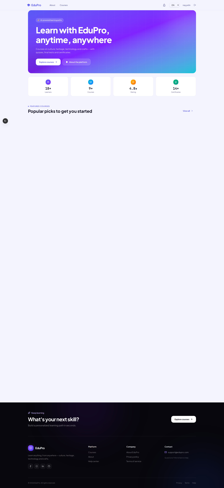
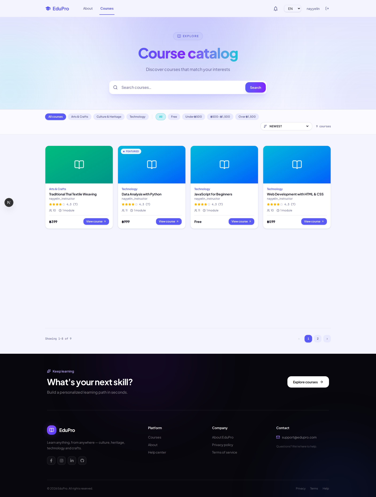
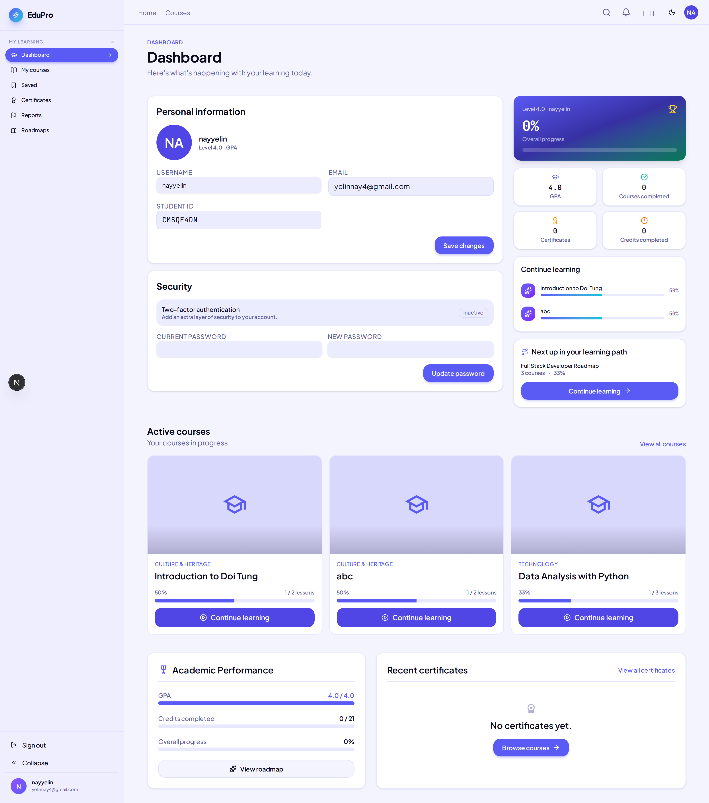
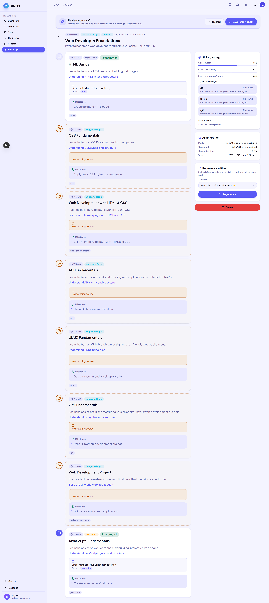
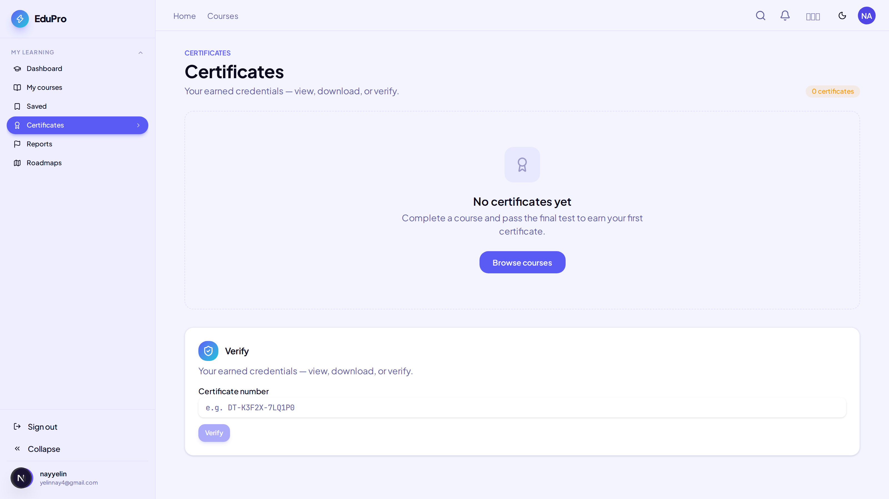
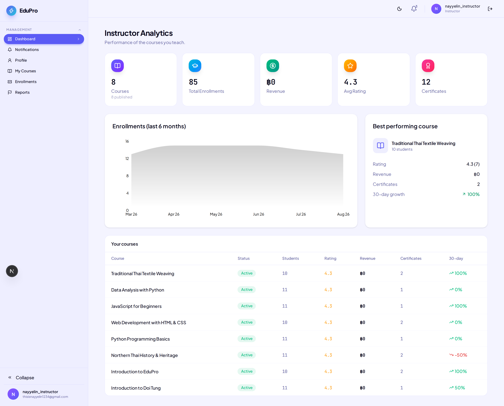
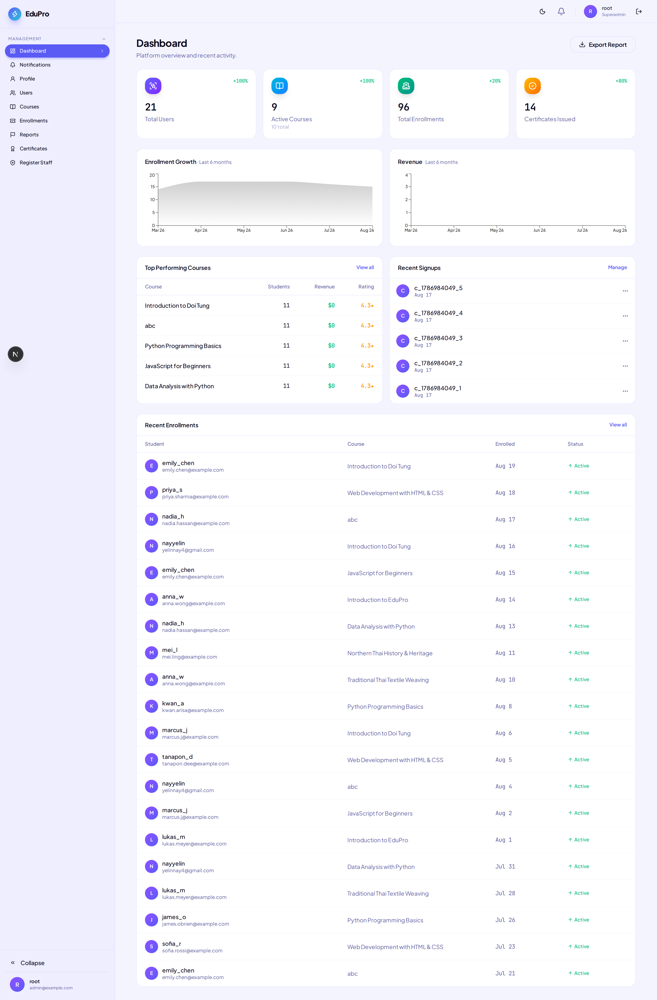

# EduPro — E-Learning Platform

> A multi-tenant e-learning platform where students learn, get assessed, and earn
> verifiable certificates — built for **Students**, **Instructors**, and **Super Admins**,
> on a secure, production-shaped foundation (Next.js 16, Prisma/Postgres, JWT auth).



---

## 🌐 Live Demo

> **Deployment URL:** `https://your-deployment-url.com`
> _(Replace this with your live link once deployed — e.g. Vercel, Render, or a VPS.)_

A set of pre-created demo accounts is provided below so you can explore every role
without signing up.

## 🔑 Demo Accounts

All accounts are **email-verified** and share the same password:

| Role          | Username          | Email                        | Password      |
| ------------- | ----------------- | ---------------------------- | ------------- |
| **Student**   | `demo_student`    | `student@edupro.dev`         | `Demo@Pass123` |
| **Instructor**| `demo_instructor` | `instructor@edupro.dev`      | `Demo@Pass123` |
| **Super Admin**| `demo_admin`     | `admin@edupro.dev`           | `Demo@Pass123` |

**What to try:**
- **Student** — browse the catalog, open the enrolled course, complete lessons/quizzes,
  pass the final test, then **request a certificate** (the instructor gets notified).
- **Instructor** — open the same course from the instructor dashboard: edit content,
  review the certificate request, and approve/reject it.
- **Super Admin** — manage users, courses, and platform analytics from `/staff`.

> The demo instructor already owns the seeded course and the demo student is already
> enrolled, so the full learning → certificate → approval loop works out of the box.

---

## 🎯 MVP — What This Project Demonstrates

The **minimum viable product** is a complete, end-to-end learning loop on a secure,
multi-tenant foundation:

1. **Enroll** — a student joins a free (or paid) course.
2. **Learn** — progress through lessons (video/text) and knowledge-check quizzes.
3. **Assess** — take a timed final test (one question at a time, with review & timer).
4. **Certify** — on passing, the student requests a certificate, which notifies the
   instructor and can be approved, rejected, or auto-issued.
5. **Administer** — instructors author courses & view analytics; super admins run the
   whole platform.

Built on top of that loop are the "extras" that make it feel like a real product:
AI-generated learning roadmaps, Stripe payments, instructor/student analytics, public
certificate verification, and two-step login. These are wired into the UI and gated
behind environment configuration (see [Configuration](#configuration-required-services)).

**In short:** the MVP is a working course → lesson → quiz → test → certificate pipeline
across three roles, with secure auth — everything else is layered on top of it.

## ✨ Highlights

- 🤖 **AI-Powered Learning Roadmaps** — describe your goal and get a personalized, week-by-week learning path mapped to real courses in the catalog
- 🎓 **Certificates with Public Verification** — earn verifiable certificates (PDF) after completing a course and passing its final test
- 💳 **Stripe Payments & Enrollment** — free and paid courses, saved courses, and instant enrollment results
- 📊 **Analytics for Instructors & Admins** — enrollments, revenue, ratings, and growth charts (Recharts)
- 🔐 **Secure Auth** — email/password with verification, two-step verification (OTP), rate limiting, and JWT sessions

## Screenshots

### Course Catalog

Search, filter by category and price, and sort courses.



### Student Dashboard

Track overall progress, GPA, active courses, and continue learning where you left off.



### AI Learning Roadmap

Enter a career goal and the AI generates a structured path with weekly topics, milestones, and skill coverage — matched against available courses.



### Certificates

View, download, and verify earned credentials by certificate number.



### Instructor Analytics

Instructors see enrollments, revenue, ratings, and per-course performance for the courses they teach.



### Admin Dashboard

Platform-wide overview: users, courses, enrollments, certificates issued, revenue, and recent activity — with user and course management tools.



## Features by Role

### Student

- Browse and search the course catalog with category/price filters
- Enroll in free or paid courses (Stripe checkout)
- Save courses for later
- Learn with lessons, quizzes, and final tests
- Track progress, GPA, and credits on the dashboard
- Generate AI learning roadmaps and follow them course by course
- Earn, download, and verify certificates

### Instructor

- Create, edit, publish/unpublish, and delete courses
- Manage modules, lessons, quizzes, and final tests
- View enrollments and per-student progress
- Review and decide on certificate requests
- Analytics dashboard: enrollments, revenue, ratings, certificates, 30-day growth

### Super Admin

- Platform overview with exportable reports
- Manage users (search, ban/unban) and register staff
- Manage all courses, enrollments, and certificates
- Send platform notifications to users
- Revenue and enrollment growth charts

## Tech Stack

- **Framework**: Next.js 16 (App Router), React 19, TypeScript
- **Styling**: Tailwind CSS v4, shadcn/ui (Radix), Lucide icons
- **State/Data**: TanStack Query, Zod validation
- **Database**: PostgreSQL with Prisma ORM (multi-tenant)
- **Auth & Security**: JWT (`jose`), bcrypt, two-step verification (OTP), Upstash Redis rate limiting, secure httpOnly cookies
- **Payments**: Stripe
- **Background Jobs**: Upstash QStash
- **Media Storage**: Cloudinary (course images/videos, profile images)
- **Email**: Resend / Nodemailer (verification, OTP)
- **Certificates**: PDFKit
- **Charts**: Recharts

## Getting Started

```bash
# install dependencies
npm install

# set up environment variables
cp .env.example .env

# run migrations and seed the database
npm run db:migrate
npm run db:seed

# (optional) create the pre-verified demo accounts from the table above
npm run seed:demo

# start the dev server
npm run dev
```

Open [http://localhost:3000](http://localhost:3000) in your browser and log in with any
demo account.

## Configuration (Required Services)

The core MVP (auth, courses, lessons, quizzes, tests, certificates, roles) runs with
just a Postgres database. The following features require their own API keys in `.env`:

| Feature | Requires |
| --- | --- |
| Email verification / OTP / password reset | Resend or SMTP (`EMAIL_*`) |
| AI learning roadmaps | LLM provider key (`AI_*`) |
| Stripe payments | `STRIPE_SECRET_KEY` + webhook |
| Course images / video | Cloudinary (`CLOUDINARY_*`) |
| Rate limiting | Upstash Redis (`UPSTASH_REDIS_*`) |

Without these, the corresponding UI sections will show graceful "not configured"
states but the rest of the app remains fully functional.

## Scripts

| Command | Description |
| --- | --- |
| `npm run dev` | Start development server |
| `npm run build` | Production build |
| `npm run lint` | Run ESLint |
| `npm run typecheck` | TypeScript type check |
| `npm run test` | Run unit tests |
| `npm run test:integration` | Run integration tests |
| `npm run db:migrate` | Run Prisma migrations |
| `npm run db:seed` | Seed the database (prisma seed) |
| `npm run seed:demo` | Create the pre-verified demo accounts (`scripts/seed-demo-accounts.ts`) |

## License

See [LICENSE](LICENSE).
